<div align="center">

# Retail Intelligence Engine: Automated Cloud ETL & Customer Insights Dashboard
### End-to-End Data Pipeline | Consumer Behavior Analytics | Zero-Touch Automation


</div>

---

## 📖 Executive Summary
Designed and deployed a fully automated, production-grade data pipeline for **Amante's Decadent Moist Cakes**, a retail business in San Pablo City, Laguna. This system eliminates manual data entry by extracting daily POS reports from email, transforming them via Python in the cloud, and updating a Power BI dashboard—all with zero human intervention.

### ⚡ Key Features
* **100% Automation:** Reduced daily manual data entry from 30 mins to **0 mins**.
* **Serverless Architecture:** Runs entirely on GitHub Actions (Cron Schedule) and Google Cloud Platform.
* **Idempotent Design:** Prevents duplicate data processing using an automated archival strategy.
* **Secure:** Implements GCP Service Account authentication via Base64-encoded GitHub Secrets.


# 2. Data Architecture Diagram

```mermaid
graph TD
    %% Nodes
    POS(POS System Email)
    GAS(Google Apps Script <br/> ⏰ 1:00 AM)
    
    subgraph Google_Drive [Google Drive Storage]
        RAW[📂 raw_pos_reports <br/> Staging Area]
        ARCHIVE_POS_REPORTS[📂 archived_pos_reports <br/> Archive History]
        MASTER_REPORT_FILE[📊 fact_sales2026<br/> Supabase Database]
    end
    
    subgraph GitHub_Cloud [GitHub Actions Cloud]
        PY(Python Automation <br/> ⏰ 1:30 AM)
        SECRET[🔒 GCP Service Key <br/> Base64 Encoded Secret]
    end
    
    PBI(Power BI Dashboard <br/> 🔄 Auto-Refresh)
    
    %% Connections
    POS -->|Attachment| GAS
    GAS -->|Save File| RAW
    
    RAW -->|Read Data| PY
    SECRET -.->|Authenticate| PY
    
    PY -->|Append Data| MASTER_REPORT_FILE
    PY -->|Move File| ARCHIVE_POS_REPORTS
    
    MASTER_REPORT_FILE -->|Import Data| PBI
    
    %% Styling
    style PY fill:#1F1F1F,stroke:#333,stroke-width:2px
    style MASTER_REPORT_FILE fill:#1F1F1F,stroke:#333,stroke-width:2px
    style SECRET fill:#fff,stroke:#f00,stroke-width:2px,stroke-dasharray: 5 5
```




# 3. Situation, Task, Action, and Result (STAR Narrative)
# Situation: 
*Daily sales reports arrived as raw Excel attachments. Manually cleaning and transforming the raw report file using Python and merging it into the master file was prone to copy-paste errors and required daily manual effort.*

# Task: 
*I needed a 'Vacation Mode' solution—a system that could handle the entire data lifecycle even while I am on vacation or even I am asleep, ensuring the dashboard is going to be ready by 8:00 AM.*

# Action:
* *Wrote a Google Apps Script to automatically grabs the report sent by the POS system*

* *Developed a Python (Pandas) script to clean/transform data and append it to the Master Report File*

* *Leveraged Google Drive API for cloud storage manipulation*

* *Containerized the environment using GitHub Actions, setting up a CRON job to run the Python script nightly on a virtual server*

* *Secured credentials using GCP Service Accounts and GitHub Secrets (Base64 encoded) to prevent key leakage*

# Result: 
*Reduced daily data admin time from 1 hour to 0 minutes. Eliminated data entry errors. The Power BI dashboard now provides real-time insights immediately upon opening*

# 4. Proof of Work

### 4.1 Screenshots
+ ### *GitHub Actions*


+ ### *Google Drive Folders*


+ ### *Power BI Dashboard*


# 4. Code Snippets

### 4.1. Advanced Feature Engineering
One challenge was that the raw data lacked granular attributes. I used **Regex** and **Dictionary Mapping** to derive new columns (Size, Date, Category) from unstructured text strings.

```python
# A. Regex Extraction: Pulling product sizes (e.g., "Solo", "Duo") from raw names
df['Size'] = df['Product Name'].str.extract(f'({size_keyword_pattern})', flags=re.IGNORECASE, expand=False).str.title()

# B. Filename Parsing: Extracting the report date from the file name itself
match = re.search(r'(\d{4}-\d{2}-\d{2})', file_name)
string_date = match.group(1) if match else 'date_error'
df['Date'] = pd.to_datetime(string_date, format='%Y-%m-%d')

# C. Hierarchical Mapping: Assigning Categories based on Product IDs
df['Sub-Category'] = df['Product'].map(PRODUCT_TO_SUBCATEGORY_MAP)
df['Category'] = df['Sub-Category'].map(SUBCATEGORY_TO_MAIN_MAP)
```

### 4.2. The Cloud Automation Loop
```python
for file in files:
        print(f"Processing: {file['name']}")
        
        # Download
        request = drive_service.files().get_media(fileId=file['id'])
        file_content = io.BytesIO(request.execute())
        
        # Clean Data (using the function raw_report_transform)
        clean_df = raw_report_transform(file_content, file['name'])
        
        if clean_df is not None:
            processed_dfs.append(clean_df)
            
            # Archive the file (Move to processed folder)
            drive_service.files().update(
                fileId=file['id'],
                addParents=ARCHIVE_FOLDER_ID,
                removeParents=RAW_FOLDER_ID
            ).execute()

    # 5. Append and Upload Master
    if processed_dfs:
        print("Appending to Master...")
        combined_new = pd.concat(processed_dfs)
        updated_master = pd.concat([master_df, combined_new], ignore_index=True)

        str_output = io.StringIO()
        updated_master.to_csv(str_output, index=False)
	    byte_output = io.BytesIO(str_output.getvalue().encode('utf-8'))
 

        # Update the file in Drive
        media_body = MediaIoBaseUpload(byte_output, mimetype='text/csv', resumable=True)
        drive_service.files().update(
            fileId=MASTER_FILE_ID,
            media_body=media_body
        ).execute()
        
        print(f"SUCCESS! Master file updated with {len(combined_new)} new rows.")
