# 1. About the project
## Title: Automated Cloud ETL Pipeline for Retail Sales Analytics
### A Zero-Touch Data Architecture using Python, GitHub Actions, and Google Cloud Platform 
#### Designed and deployed a fully automated data pipeline for Amante's Decadent Moist Cakes that extracts their daily POS reports, transforms raw data via Python scripts in the cloud, and updates their Power BI dashboard without human intervention.


# 2. Data Architecture Diagram

```mermaid
graph TD
    %% Nodes
    POS(POS System Email)
    GAS(Google Apps Script <br/> ⏰ 1:00 AM)
    
    subgraph Google_Drive [Google Drive Storage]
        RAW[📂 raw_pos_reports <br/> Staging Area]
        ARCHIVE_POS_REPORTS[📂 archived_pos_reports <br/> Archive History]
        MASTER_REPORT_FILE[📊 Master_Report.csv <br/> Main Database]
    end
    
    subgraph GitHub_Cloud [GitHub Actions Cloud]
        PY(Python Automation <br/> ⏰ 1:45 AM)
        SECRET[🔒 GCP Service Key <br/> Base64 Encoded Secret]
    end
    
    PBI(Power BI Dashboard <br/> 🔄 Auto-Refresh)
    
    %% Connections
    POS -->|Attachment| GAS
    GAS -->|Save File| RAW
    
    RAW -->|Read Data| PY
    SECRET -.->|Authenticate| PY
    
    PY -->|Append Data| MASTER_REPORT_FILE
    PY -->|Move File| ARCHIVE_POS_REPORTS
    
    MASTER_REPORT_FILE -->|Import Data| PBI
    
    %% Styling
    style PY fill:#1F1F1F,stroke:#333,stroke-width:2px
    style MASTER_REPORT_FILE fill:#1F1F1F,stroke:#333,stroke-width:2px
    style SECRET fill:#fff,stroke:#f00,stroke-width:2px,stroke-dasharray: 5 5
```




# 3. Situation, Task, Action, and Result (STAR Narrative)
# Situation: 
*Daily sales reports arrived as raw Excel attachments. Manually cleaning and transforming the raw report file using Python and merging it into the master file was prone to copy-paste errors and required daily manual effort.*

# Task: 
*I needed a 'Vacation Mode' solution—a system that could handle the entire data lifecycle even while I am on vacation or even I am asleep, ensuring the dashboard is going to be ready by 8:00 AM.*

# Action:
* *Wrote a Google Apps Script to automatically grabs the report sent by the POS system*

* *Developed a Python (Pandas) script to clean/transform data and append it to the Master Report File*

* *Leveraged Google Drive API for cloud storage manipulation*

* *Containerized the environment using GitHub Actions, setting up a CRON job to run the Python script nightly on a virtual server*

* *Secured credentials using GCP Service Accounts and GitHub Secrets (Base64 encoded) to prevent key leakage*

# Result: 
*Reduced daily data admin time from 1 hour to 0 minutes. Eliminated data entry errors. The Power BI dashboard now provides real-time insights immediately upon opening*

# 4. Proof of Work

### 4.1 Screenshots
+ ### *GitHub Actions*


+ ### *Google Drive Folders*


+ ### *Power BI Dashboard*


# 4. Code Snippets

### 4.1. Advanced Feature Engineering
One challenge was that the raw data lacked granular attributes. I used **Regex** and **Dictionary Mapping** to derive new columns (Size, Date, Category) from unstructured text strings.

```python
# A. Regex Extraction: Pulling product sizes (e.g., "Solo", "Duo") from raw names
df['Size'] = df['Product Name'].str.extract(f'({size_keyword_pattern})', flags=re.IGNORECASE, expand=False).str.title()

# B. Filename Parsing: Extracting the report date from the file name itself
match = re.search(r'(\d{4}-\d{2}-\d{2})', file_name)
string_date = match.group(1) if match else 'date_error'
df['Date'] = pd.to_datetime(string_date, format='%Y-%m-%d')

# C. Hierarchical Mapping: Assigning Categories based on Product IDs
df['Sub-Category'] = df['Product'].map(PRODUCT_TO_SUBCATEGORY_MAP)
df['Category'] = df['Sub-Category'].map(SUBCATEGORY_TO_MAIN_MAP)
```

### 4.2. The Cloud Automation Loop
```python
for file in files:
    # 1. Fetch file from Google Drive into Memory
    request = drive_service.files().get_media(fileId=file['id'])
    file_content = io.BytesIO(request.execute())
    
    # 2. Transform Data using clean_report_data function
    clean_df = clean_report_data(file_content, file['name'])
    
    if clean_df is not None:
        processed_dfs.append(clean_df)
        
        # 3. Archive the raw file
        # Moves file from 'raw_pos_reports' -> 'archived_pos_reports'
        drive_service.files().update(
            fileId=file['id'],
            addParents=ARCHIVE_FOLDER_ID,
            removeParents=RAW_FOLDER_ID
        ).execute()
        
print(f"✅ Batch Processing Complete. {len(processed_dfs)} files merged.")
