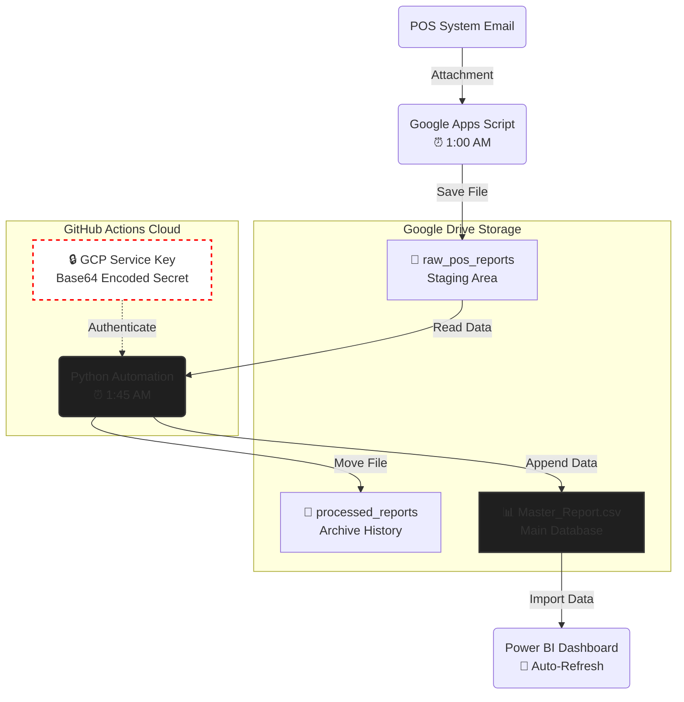

# Automated-Cloud-ETL-Pipeline-for-Retail-Sales-Analytics
A real life automation project for Amante's Decadent Moist Cakes' Data Management and Business Intelligence Reporting

```mermaid
graph TD
    %% Nodes
    POS(POS System Email)
    GAS(Google Apps Script <br/> ⏰ 1:00 AM)
    
    subgraph Google_Drive [Google Drive Storage]
        RAW[📂 raw_pos_reports <br/> Staging Area]
        ARCHIVE[📂 processed_reports <br/> Archive History]
        MASTER[📊 Master_Report.csv <br/> Main Database]
    end
    
    subgraph GitHub_Cloud [GitHub Actions Cloud]
        PY(Python Automation <br/> ⏰ 1:45 AM)
        SECRET[🔒 GCP Service Key <br/> Base64 Encoded Secret]
    end
    
    PBI(Power BI Dashboard <br/> 🔄 Auto-Refresh)
    
    %% Connections
    POS -->|Attachment| GAS
    GAS -->|Save File| RAW
    
    RAW -->|Read Data| PY
    SECRET -.->|Authenticate| PY
    
    PY -->|Append Data| MASTER
    PY -->|Move File| ARCHIVE
    
    MASTER -->|Import Data| PBI
    
    %% Styling
    style PY fill:#1F1F1F,stroke:#333,stroke-width:2px
    style MASTER fill:#1F1F1F,stroke:#333,stroke-width:2px
    style SECRET fill:#fff,stroke:#f00,stroke-width:2px,stroke-dasharray: 5 5
```
